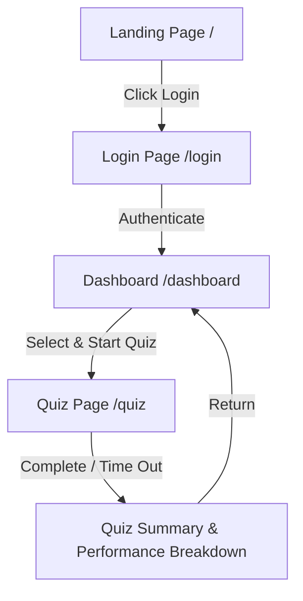

# Quiz Master Platform (BEE Project - Sem 5)

An interactive, modern, full-stack ready Quiz Platform designed for taking subject-specific quizzes, tracking performance analytics, and managing user sessions. Built with **React 18 (TypeScript)**, **Vite**, **Tailwind CSS**, and **Node.js / Express (TypeScript)**.

---

## 🚀 Features

- 🎨 **Modern & Responsive UI**: Sleek dark mode styling with interactive 3D/canvas visual effects, micro-animations, and full mobile/desktop responsiveness.
- 🔐 **Authentication System**: User login and registration flow with session persistence via `localStorage` and protected route authorization guards (`ProtectedRoute`).
- 📊 **Interactive Dashboard**:
  - Personal user dashboard displaying performance stats (average score, completed quizzes, active streak).
  - Quick action buttons to launch new quizzes or resume active sessions.
  - Recent activity feed and subject categories.
- 🎯 **Feature-Rich Quiz Engine**:
  - Dynamic subject and topic selection (e.g., Basic Electrical Engineering - BEE, CS Core, Web Technologies).
  - Real-time countdown timer with automated submission on time expiry.
  - Interactive question palette for quick navigation between questions.
  - Flagging/bookmarking questions for review before submitting.
  - Immediate score calculation, result breakdown, and detailed answer explanations.
- ⚡ **Full-Stack TypeScript Architecture**: End-to-end type safety with TypeScript on both frontend (React + Vite) and backend (Express.js API).

---

## 🛠️ Tech Stack

### **Frontend**
- **Language & Framework**: [TypeScript](https://www.typescriptlang.org/) + [React 18](https://react.dev/) + [Vite 5](https://vitejs.dev/)
- **Routing**: [React Router v6](https://reactrouter.com/)
- **Styling**: [Tailwind CSS v4](https://tailwindcss.com/) + PostCSS
- **Visuals & Icons**: Custom Canvas 3D background replica, Framer Motion, Lucide Icons

### **Backend**
- **Language & Runtime**: [TypeScript](https://www.typescriptlang.org/) + [Node.js](https://nodejs.org/) (v18+ recommended)
- **Framework**: [Express.js v4](https://expressjs.com/)
- **Development Tooling**: `tsx` watch mode for instant TypeScript hot reloading

---

## 📁 Project Structure

```text
BEE_pro/
├── client/                   # React + TypeScript Frontend Application
│   ├── src/
│   │   ├── app/
│   │   │   └── App.tsx       # App root, routes, and AuthContext provider
│   │   ├── components/       # Reusable UI components
│   │   │   ├── ui/
│   │   │   │   └── HandDrawn.tsx   # Hand-drawn SVG filter canvas component
│   │   │   ├── HeroThreeReplica.tsx
│   │   │   └── ProtectedRoute.tsx
│   │   ├── context/
│   │   │   └── AuthContext.tsx
│   │   ├── features/
│   │   │   └── quiz/
│   │   │       └── QuizPageContent.tsx
│   │   ├── lib/
│   │   │   └── utils.ts
│   │   ├── pages/
│   │   │   ├── DashboardPage.tsx
│   │   │   ├── LandingPage.tsx
│   │   │   ├── LoginPage.tsx
│   │   │   └── QuizPage.tsx
│   │   ├── main.tsx
│   │   └── vite-env.d.ts
│   ├── .env.local.example
│   ├── index.html
│   ├── package.json
│   ├── styles.css
│   ├── tailwind.config.js
│   ├── tsconfig.json
│   └── vite.config.ts
├── server/                   # Node.js + Express TypeScript Backend Server
│   ├── src/
│   │   └── server.ts         # Express server entry point & health endpoint
│   ├── .env.example          # Backend environment configuration template
│   ├── package.json          # Backend dependencies & scripts
│   └── tsconfig.json         # Backend TypeScript configuration
├── package.json              # Root package.json with workspace dev scripts
├── .gitignore
└── README.md                 # Project documentation
```

---

## 💻 Quick Start & Setup Guide

### **Prerequisites**
Ensure you have the following installed on your machine:
- **Node.js**: v18.0.0 or higher
- **npm**: v9.0.0 or higher

---

### 1️⃣ Clone the Repository

```bash
git clone https://github.com/Moksh008/BEE-project-sem5.git
cd BEE-project-sem5
```

---

### 2️⃣ Frontend Setup (`client`)

1. **Navigate & Install Dependencies**:
   ```bash
   cd client
   npm install
   ```

2. **Configure Environment Variables**:
   ```bash
   cp .env.local.example .env.local
   ```

3. **Run Development Server**:
   ```bash
   npm run dev
   ```
   Available at: **`http://localhost:5173`**

4. **Build for Production**:
   ```bash
   npm run build
   ```

---

### 3️⃣ Backend Setup (`server`)

1. **Navigate & Install Dependencies**:
   ```bash
   cd server
   npm install
   ```

2. **Configure Environment Variables**:
   ```bash
   cp .env.example .env
   ```

3. **Run Backend Development Server**:
   ```bash
   npm run dev
   ```
   Express server running at: **`http://localhost:5000`**

---

### 4️⃣ Root Quick Commands

From the root directory (`BEE_pro/`), you can also run:

```bash
# Start Client Dev Server
npm run dev:client

# Start Server Dev Server
npm run dev:server

# Build Client
npm run build:client

# Build Server
npm run build:server
```

---

## 📡 API Endpoints

### Health Check Endpoint
- **URL**: `/api/health`
- **Method**: `GET`
- **Response**:
  ```json
  {
    "status": "ok",
    "service": "bee-pro-backend"
  }
  ```

---

## 🔄 User Navigation Flow



---

## 📌 Available NPM Scripts

### Frontend Scripts (Root Directory)
| Command | Description |
| :--- | :--- |
| `npm run dev` | Launches Vite local development server with HMR |
| `npm run build` | Bundles and optimizes the app for production in `dist/` |
| `npm run preview` | Spins up a local server to preview the built production app |

### Backend Scripts (`backend/` Directory)
| Command | Description |
| :--- | :--- |
| `npm run dev` | Starts Node server with native file watcher (`node --watch`) |
| `npm run start` | Runs Node server in standard production mode |

---

## 🔮 Future Enhancements

- 🗄️ Database Integration (MongoDB / PostgreSQL) for dynamic question banks & user profile storage.
- 🔑 JWT-based Secure Authentication with Refresh Tokens.
- 🏆 Global & Course Leaderboards.
- 🛠️ Admin Portal to create, edit, and publish new quizzes dynamically.

---

## 📄 License

This project is created for academic coursework (**BEE Project - Semester 5**).

